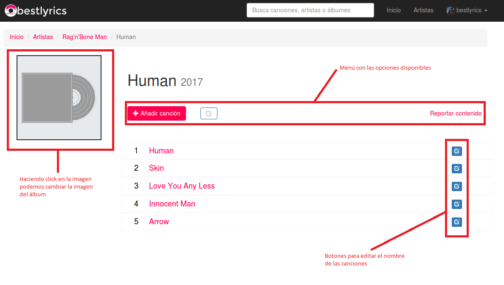
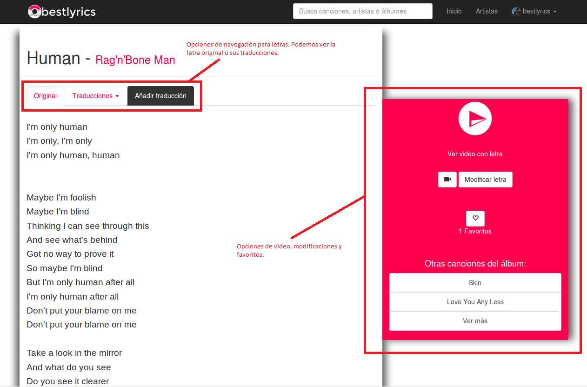
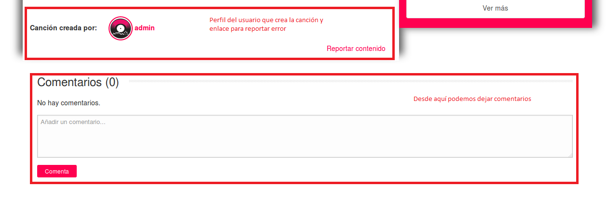
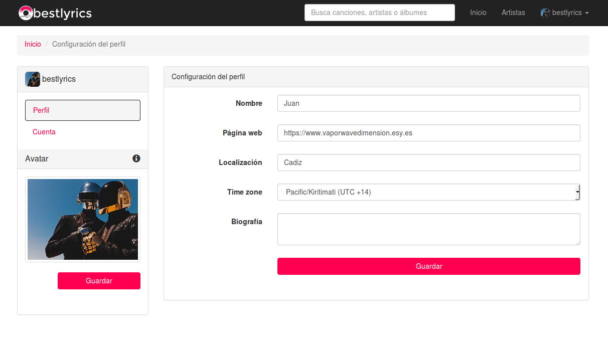

Manual básico de usuario
========================

**Pantalla principal**

En la página principal podemos ver arriba un menú de navegación con el logotipo de la aplicación a la izquierda que regresa a la página principal desde cualquier sitio de la aplicación. A la derecha tenemos las opciones relacionadas con el perfil del usuario y una sección de Artistas donde podemos empezar a crear nuestros artistas favoritos.
En el menú de navegación también se dispone de un buscador para encontrar artistas, canciones y álbumes.

Desde la página principal se dispone al usuario de otro buscador, de una sección de canciones favoritas de la comunidad (que se actualiza cada mes) y una sección de ultimas letras añadidas.

---
**Perfil del artista**

Desde el perfil del artista podemos añadir una imagen al artista si aún no la tiene, para ello haremos click en la imagen por defecto y tan solo debemos escoger la imagen.
En este perfil también podemos modificar el perfil del artista, añadir álbumes al artista, reportar algún error y ver los géneros relacionados con el artista.

---
**Perfil del álbum**

Desde esta vista podemos añadir como con el artista una imagen para el álbum. Al igual que el artista, se debe hacer click en la imagen y escoger una foto.
También se dispone de botones para varias opciones para el álbum y de botones para editar el nombre de las canciones.

---
**Letra de la canción**

Desde aquí podemos ver todo lo relacionado con la letra de las canciones.
Justo arriba de la letra podemos ver unos paneles de navegación donde podemos ver la letra original, una traducción o añadir una traducción.
A la derecha de la letra de la canción nos acompañara siempre un menú donde podemos reproducir la canción si se le ha incluido un video. Podemos ver una vista especial con el video junto a la letra.
También podemos ver unos botones para modificar los datos relacionados con la letra y un botón para añadir la canción a favoritos.
Bajo la letra de la canción podemos ver quien creó la canción y un enlace para reportar. También es posible compartir tu opinión sobre la canción y su letra.

---
**Añadir letra**

Al añadir una letra por primera vez a una canción debemos indicar el idioma original de la canción. A la derecha nos aparecerá un cuadro con las pautas a seguir para un correcto escrito de la las letras.

---
**Perfil del usuario**

A través del menú de navegación de la barra superior podemos acceder al perfil del usuario. Desde aquí podemos ver nuestros datos, el avatar, canciones favoritas y el historial de cambios realizados en las letras.
También podemos cambiar el color en el que veremos los perfiles.

---
**Configuración del usuario**

Desde esta sección de la aplicación podremos cambiar nuestros datos y nuestro avatar.
Para cambiar el avatar se debe hacer click en la imagen, escoger la imagen y hacer click en Guardar.
